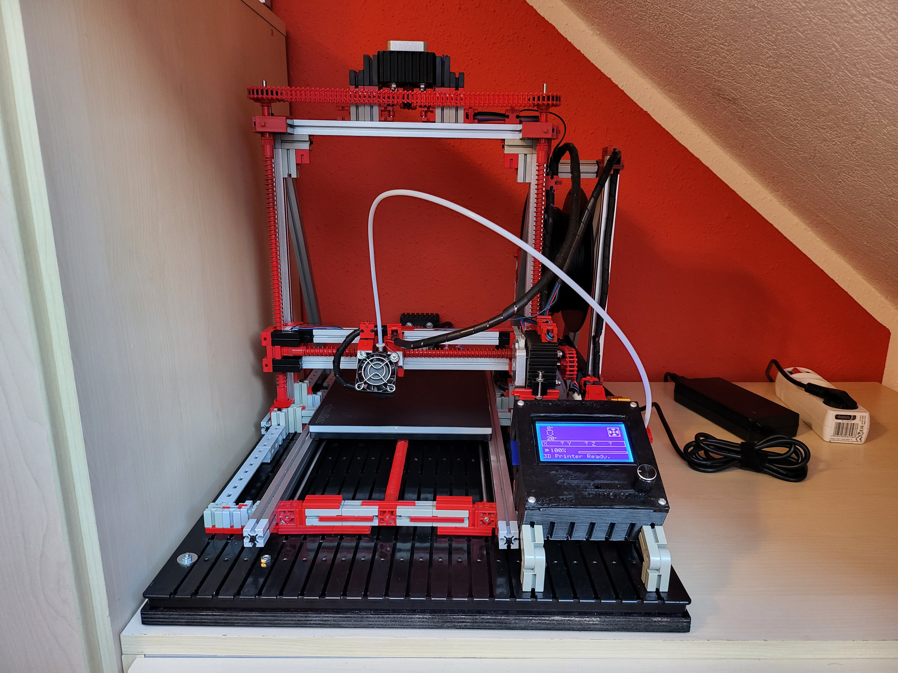

Marlin 3D Printer Firmware for Brian Schroeder's fischertechnik 3D Printer mod
==============================================================================
Modification of the original fischertechnik 3D Printer 536624 with extended build space and much better performance:
- extended build space: 185mm x 255mm x 180mm
- double speed: 75mm/s
- Runs with Marlin 3D Printer Firmware on Arduino AVR Mega ATMEGA2560
- RAMPS 1.6 Board with Graphical LCD Controller and printing from SD Card
- Nema 17 Stepper Motors
- Redrex CR10 Extruder Hot End
- Cooling Fan



For Details concerning the mechanics see ```brsc-FTI```.

Thanks and very best Regards to Marlin and RepRap.
- https://github.com/MarlinFirmware/Marlin
- https://reprap.org


# Marlin 3D Printer Firmware

<p align="center"></p>


