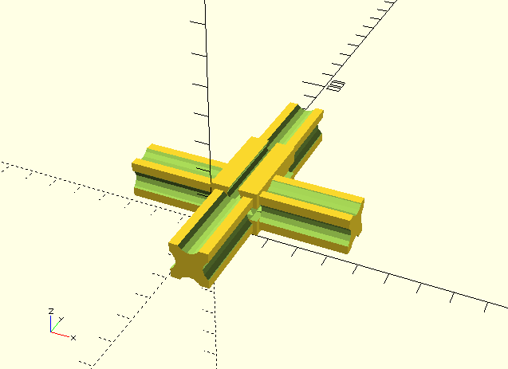
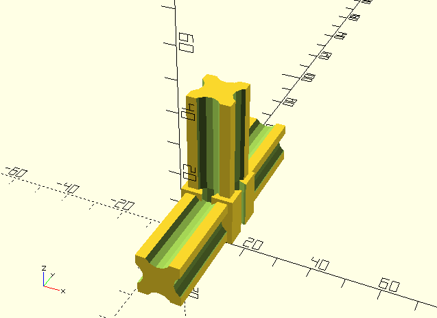
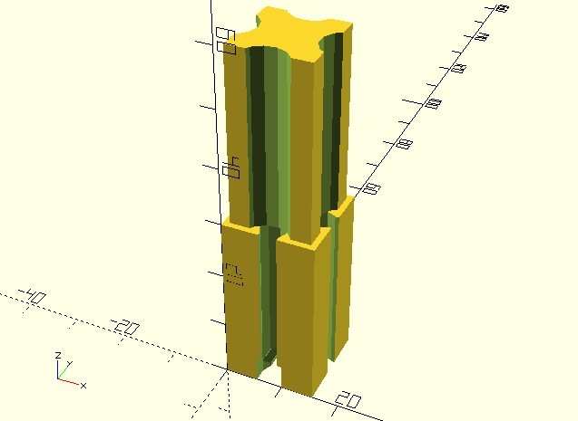

Brian Schroeder's RepRap FTI-Strap
==================================

Custom parts required for brsc/FTI-1.2.1.

# Chassis

             o . . . . . . . . . . . .o
            .|                       .|
           . b                      . b
          .  |                     .  |
         .   |                    .   |
      ..o........................o.. :|
        |  e:+ . .               |  e:+
        b  :/                    b  :/
        |__/ _ e                 |__/ _ e
        |\c                     /| c
        |/\ d                d / |/
        L----------- a ----------R

## Self printed parts
- o) 4x 'aluminum-square-tube-15x15-to-Fischertechnik-adapter-15' 
- L) 1 part of 'aluminum-square-tube-15x15-to-Fischertechnik-adapter-x-y-z-15-L' 
- R) 1 part of 'aluminum-square-tube-15x15-to-Fischertechnik-adapter-x-y-z-15-R' 
- +) 2x 'aluminum-square-tube-15x15-to-Fischertechnik-adapter-y-z-15' 

## Standard (non-Fischertechnik parts)
- a) 1x aluminium square tube 15mm x 15mm, length=330mm
- b) 4x aluminium square tube 15mm x 15mm, length=300mm
- c) 2x aluminium square tube 15mm x 15mm, length=210mm
- d) 2x aluminium square tube 15mm x 15mm, length=85mm
- e) 4x aluminium square tube 15mm x 15mm, length=105mm
- 8x Screw M4, etc.
- 8x Screw M5, etc.

# Bed

Chassis only

                H                   H
                H...1----- d -----1.H
                H /:               :H /b
                H+==------ e ------=H+
              o=+-------- c --------+~~~~o
             / /H                  /H   /
            / / H                 / H  /
           a a  H                a  H a
          / /                   /    /
         / /                   /    /
        o=T-------- c --------T~~~~o


Chassis with Plexiglass board (P) and angles (*)

                H                   H
                H...1----- d -----1.H
              PPPPPPPPPPPPPPPPPPPPPPPPPPPP
             P  *+==------ e ------=*+  P
            P o=*-------- c --------*~~P~o
           P / **                  ** P /
          P / * *                 * *P /
         P / /                   /  P /
        PPPPPPPPPPPPPPPPPPPPPPPPPPPP a
         / /                   /    /
        o=T-------- c --------T~~~~o

## Self printed parts
- +) 2x 'aluminum-square-tube-15x15-to-Fischertechnik-adapter-x-y-30-X-X'; one shortened at junction ```o=+``` 
- o) 4x 'aluminum-square-tube-15x15-to-Fischertechnik-adapter-y-z-15-with-hole'; two shortened at junction ```o=T``` and ```o=+``` 
- T) 2x 'aluminum-square-tube-15x15-to-Fischertechnik-adapter-y-z-15-T'; one shortened at junction ```o=T``` 
- 1) 2x 'aluminum-square-tube-15x15-to-Fischertechnik-adapter-15' 
- =) 2x 'aluminum-square-tube-15x15-to-Fischertechnik-adapter-30' 

## Standard (non-Fischertechnik parts)
- a) 4x aluminium square tube 15mm x 15mm, length=180mm
- =) 2x aluminium square tube 15mm x 15mm, length=15mm
- ~) 2x aluminium square tube 15mm x 15mm, length=60mm
- b) 2x aluminium square tube 15mm x 15mm, length=30mm
- c) 2x aluminium square tube 15mm x 15mm, length=170mm
- d) 1x aluminium square tube 15mm x 15mm, length=75mm
- e) 1x aluminium square tube 15mm x 15mm, length=105mm
- H) 2x aluminium H profile inner diameter 15mm x 15mm, length=90mm
- *) 2x angle
- 8x Screw M4, etc.
- P) 1x Plexiglass board 300mm x 210mm, d=5mm
- 4x Screw M4 45mm, etc. 

Details see photos.
