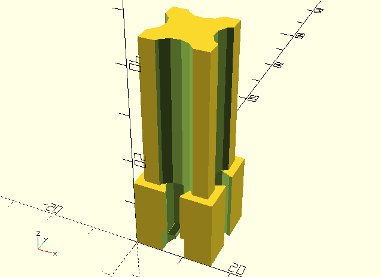
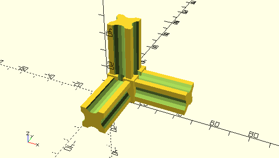
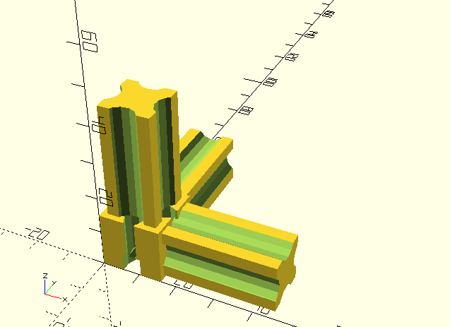
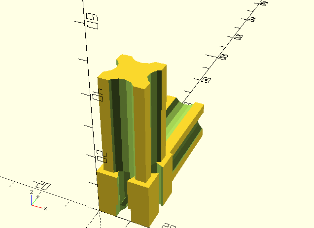
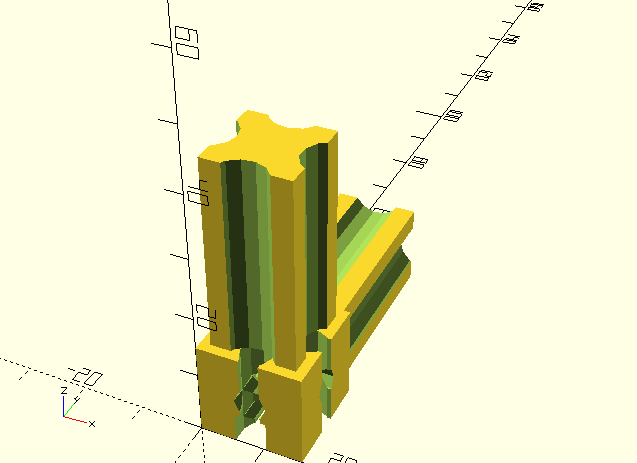

Brian Schroeder's RepRap FTI-Strap
==================================

Custom parts required for brsc/FTI-1.2-0:

Self printed parts:
- 4x 'aluminum-square-tube-15x15-to-Fischertechnik-adapter-15' 
- 1 part of 'aluminum-square-tube-15x15-to-Fischertechnik-adapter-x-y-z-15-L' 
- 1 part of 'aluminum-square-tube-15x15-to-Fischertechnik-adapter-x-y-z-15-R' 
- 2x 'aluminum-square-tube-15x15-to-Fischertechnik-adapter-y-z-15' 
- 2x 'aluminum-square-tube-15x15-to-Fischertechnik-adapter-y-z-15-with-hole' 

Standard (non-Fischertechnik parts):
- 1x aluminium square tube 15mm x 15mm, length=330mm
- 4x aluminium square tube 15mm x 15mm, length=300mm
- 2x aluminium square tube 15mm x 15mm, length=210mm

Details see photos.
