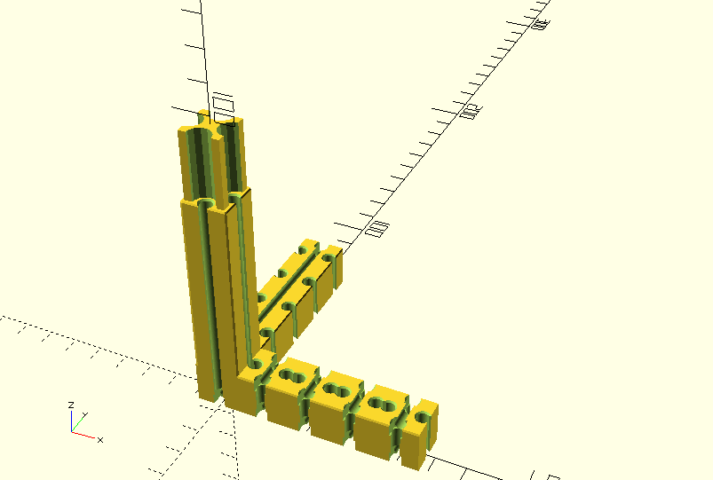
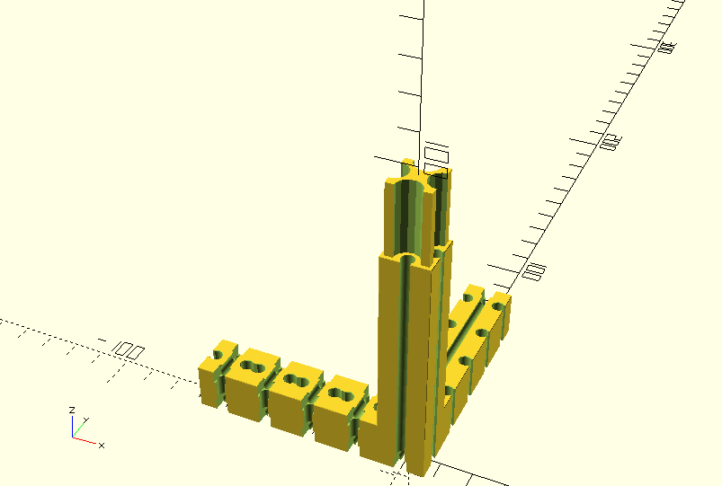
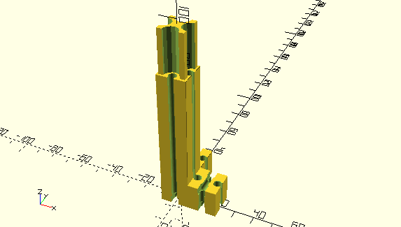
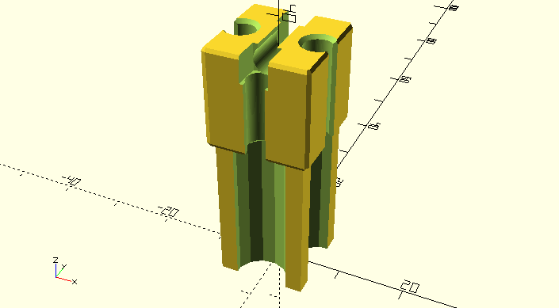
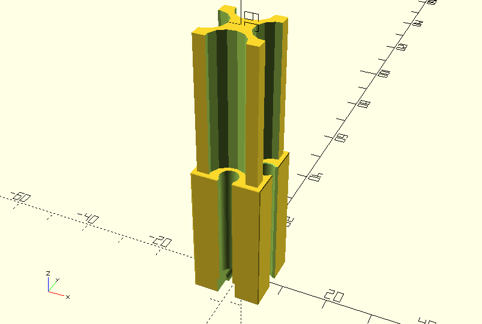
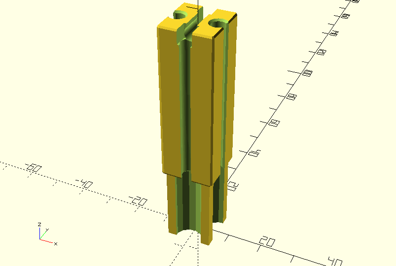
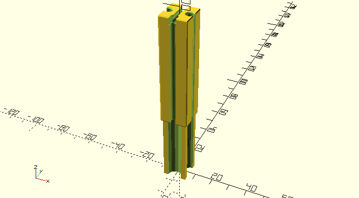
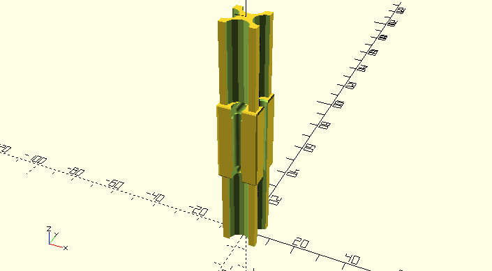

Brian Schroeder's RepRap FTI-Strap
==================================

Custom parts required for brsc/FTI-2.0.0.

# Chassis

          s. . . . . . . . . . . . . . s.
         / s. . . . . . . . . . . . . / s
        f  b  o          o           f  |
       /   |  g          g          /   b
      o............................o    |
      qp------------ a -----------pq . .|
      |  . R  g          g         |  . L
      b  ./   l. . . . . r         b  ./
      |../                         |../
      |./                         .| c
      |/.                        . |/
      L------------- a ------------R

## Self printed parts
- L) 2x 'ft-square-tube-adapter-15x15-75-15-5-L' 
- R) 2x 'ft-square-tube-adapter-15x15-75-15-5-R' 
- l) 1x 'ft-square-tube-adapter-15x15-75-15-2-L' 
- r) 1x 'ft-square-tube-adapter-15x15-75-15-2-R' 
- o) 8x 'ft-square-tube-adapter-15x15-15' 
- p) 2x 'ft-square-tube-adapter-15x15-30' 
- q) 2x 'ft-square-tube-adapter-15x15-45' 
- s) 4x 'ft-square-tube-adapter-15x15-60' 
- tdb...

## Standard (non-Fischertechnik parts)

# Bed

Chassis only

                . . . . . . . . . . .
                :                   :
                :                   :
              . O. . . .  ... . . . O. . ..
               O:         .        O:
              Oo--- a --~~~~- b -oO : 
             / \: . . . .\. . . ./.\.
            c                   c
         . L-------- f --------L. . ..

Chassis with Plexiglass board (P) and angles (*)

                . . . . . . . . . . .
              PPPPPPPPPPPPPPPPPPPPPPPPPPPPP
             PS :                   :    PS
            P . O. . . .  ... . . . O. .P..
           P   O:         .        O:  P
          P   Oo--- a --~~~~- b -oO : P
         PPPPPPPPPPPPPPPPPPPPPPPPPPPPP
         S  c                   c    S
         . L-------- f --------L. . ..

## Self printed parts
- o) 4x 'ft-square-tube-adapter-15x15-15' 
- ~) 1x 'ft-square-tube-adapter-15x15-30-DE' 
- O) 2x 'ft-square-tube-adapter-15x15-60' 
- L) 2x 'ft-square-tube-adapter-15x15-15-L' 

## Standard (non-Fischertechnik parts)
- a) 1x aluminium square tube 15mm x 15mm, length=75mm
- b) 1x aluminium square tube 15mm x 15mm, length=45mm
- c) 2x aluminium square tube 15mm x 15mm, length=120mm
- d) 1x aluminium square tube 15mm x 15mm, length=75mm
- e) 1x aluminium square tube 15mm x 15mm, length=105mm
- f) 1x aluminium square tube 15mm x 15mm, length=180mm
- S) 8x Screw M4, etc.
- P) 1x Plexiglass board 300mm x 210mm, d=5mm

Details see photos.

# Mechanics and Gears

## Thingiverse
- 4x 'Belt_Tensioner_-_Reinforced' 

