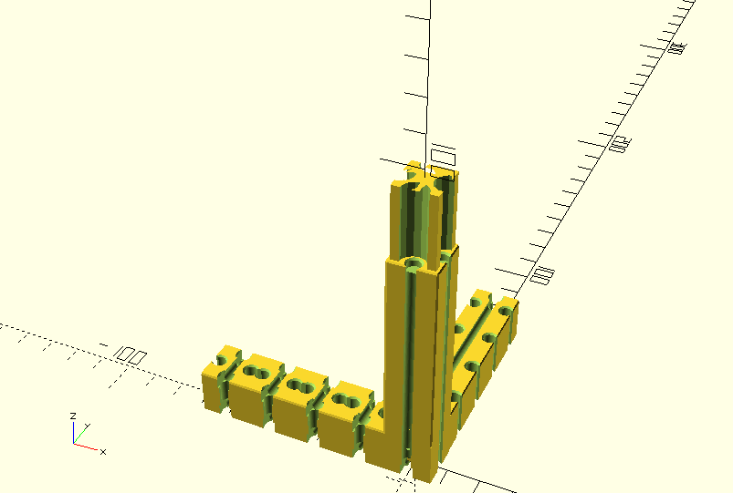

Brian Schroeder's RepRap FTI-Strap
==================================

Custom parts required for brsc/FTI-2.0.0.

# Chassis

          O. o . . . . . . . . . . . .oO
         /. .|. . . . . . . . . . . . /
        f    b  o          o         f|
       /     |  g          g        / b
      o............................o  |
      ..+----------- a ----------+.. .|
        |  . + .g.         g     |  . +
        b  ./   O. . . . . O     b  ./
        |../                     |../
        |./                     .| c
        |/.                    . |/
        L----------- a ----------R

## Self printed parts
- L) 2x 'ft-square-tube-adapter-15x15-75-15-5-L' 
- R) 2x 'ft-square-tube-adapter-15x15-75-15-5-R' 
- l) 1x 'ft-square-tube-adapter-15x15-45-15-2-L' 
- r) 1x 'ft-square-tube-adapter-15x15-45-15-2-R' 
- tdb...

## Standard (non-Fischertechnik parts)

# Bed

Chassis only

                . . . . . . . . . . .
                :...o----- d -----o.:
                :  :               ::
                H+==------ e ------=:+
              . O. . . .  ... . . . O. . ..
               O:         .        O:
              Oo--- a --~~~~- b -oO : 
             / \: . . . .\. . . ./.\.
            c                   c
         . L-------- f --------L. . ..


Chassis with Plexiglass board (P) and angles (*)

                . . . . . . . . . . .
                :...o----- d -----o.:
              PPPPPPPPPPPPPPPPPPPPPPPPPPPPP
             PS H+==------ e ------=:+   PS
            P . O. . . .  ... . . . O. .P..
           P   O:         .        O:  P
          P   Oo--- a --~~~~- b -oO : P
         PPPPPPPPPPPPPPPPPPPPPPPPPPPPP
         S  c                   c    S
         . L-------- f --------L. . ..

## Self printed parts
- +) 2x 'aluminum-square-tube-15x15-to-Fischertechnik-adapter-x-y-30-X-X'; one shortened at junction ```o_+``` 
- o) 4x 'aluminum-square-tube-15x15-to-Fischertechnik-adapter-15' 
- ~) 1x 'aluminum-square-tube-15x15-to-Fischertechnik-adapter-30-DE' 
- O) 2x 'aluminum-square-tube-15x15-to-Fischertechnik-adapter-75' 
- =) 2x 'aluminum-square-tube-15x15-to-Fischertechnik-adapter-30' 
- L) 2x 'aluminum-square-tube-15x15-to-Fischertechnik-adapter-y-z-15' 

## Standard (non-Fischertechnik parts)
- a) 1x aluminium square tube 15mm x 15mm, length=75mm
- b) 1x aluminium square tube 15mm x 15mm, length=45mm
- c) 2x aluminium square tube 15mm x 15mm, length=120mm
- d) 1x aluminium square tube 15mm x 15mm, length=75mm
- e) 1x aluminium square tube 15mm x 15mm, length=105mm
- f) 1x aluminium square tube 15mm x 15mm, length=180mm
- S) 8x Screw M4, etc.
- P) 1x Plexiglass board 300mm x 210mm, d=5mm

Details see photos.

# Mechanics and Gears

## Thingiverse
- 2x 'Belt_Tensioner_-_Reinforced' 

